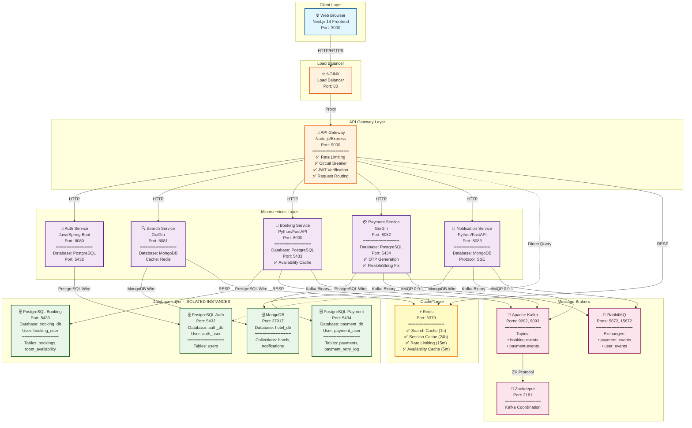
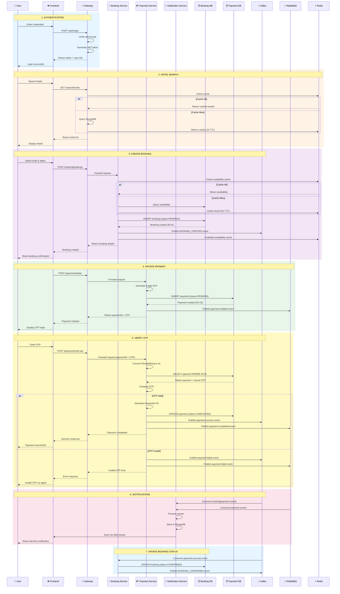
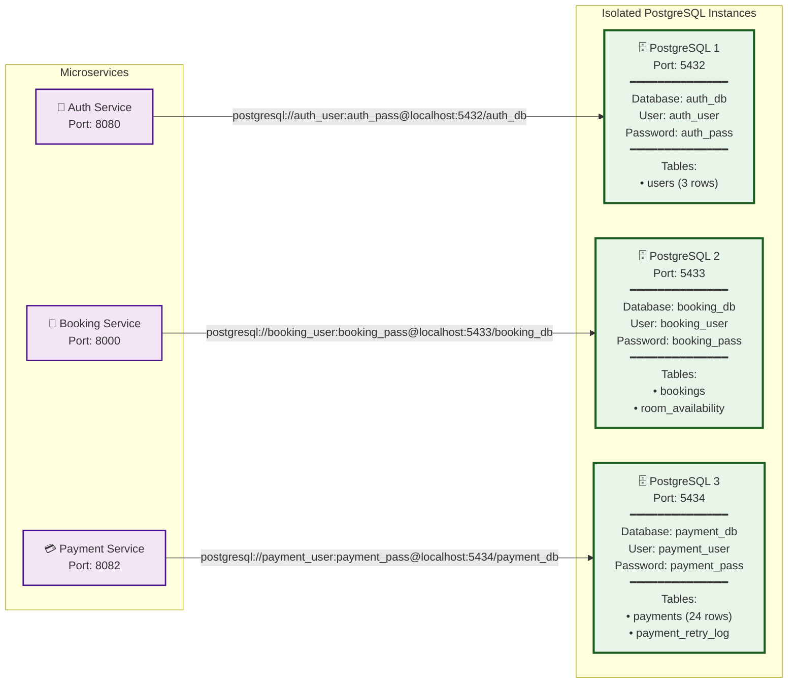
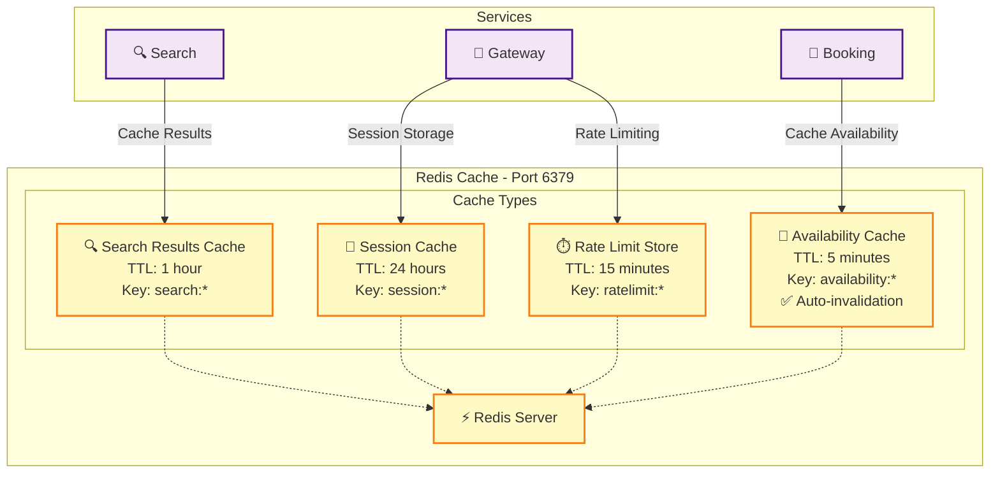
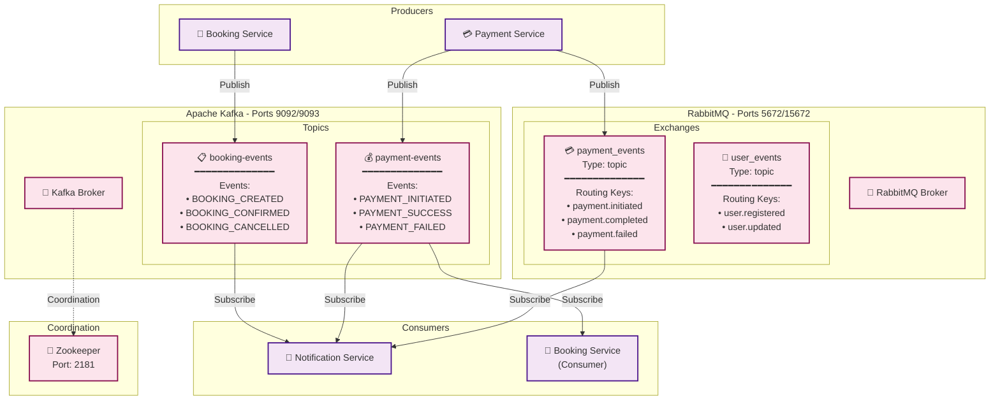
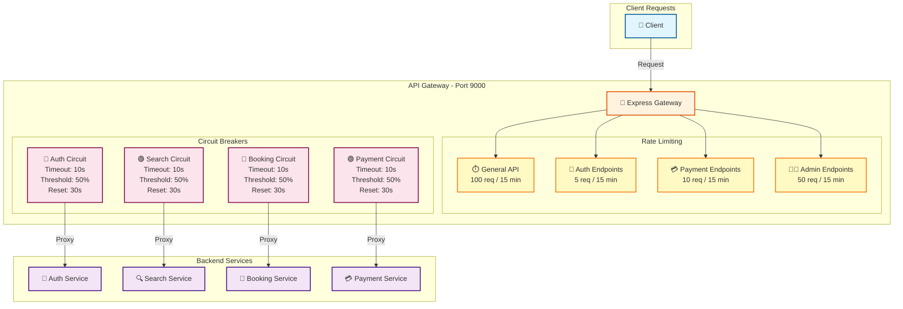

# 🏗️ Updated System Architecture - Mermaid Diagrams

**Last Updated**: 2025-10-14  
**Status**: ✅ All Features Working

---

## 📊 **DIAGRAM 1: Complete System Architecture**

---

## 📊 **DIAGRAM 2: Complete Workflow - Booking & Payment**

---

## 📊 **DIAGRAM 3: Database Isolation Architecture**

---

## 📊 **DIAGRAM 4: Redis Multi-Purpose Caching**

---

## 📊 **DIAGRAM 5: Message Broker Architecture**

---

## 📊 **DIAGRAM 6: Gateway Features - Rate Limiting & Circuit Breaker**

---

## 📝 **Architecture Summary**

### **Technology Stack**:
- **Frontend**: Next.js 14, React, TypeScript, Zustand, Axios
- **API Gateway**: Node.js, Express, express-rate-limit, opossum
- **Microservices**: 
  - Auth: Java/Spring Boot
  - Search: Go/Gin
  - Booking: Python/FastAPI
  - Payment: Go/Gin
  - Notification: Python/FastAPI
- **Databases**: 
  - PostgreSQL 16 (3 isolated instances)
  - MongoDB 6
- **Cache**: Redis 7
- **Message Brokers**: Kafka, RabbitMQ
- **Load Balancer**: NGINX

### **Key Features Implemented**:
✅ Database Isolation (3 separate PostgreSQL instances)  
✅ Redis Multi-Purpose Caching (4 strategies)  
✅ Rate Limiting (4 different limits)  
✅ Circuit Breaker Pattern  
✅ OTP-Based Payment Verification  
✅ Real-time Notifications (SSE)  
✅ Event-Driven Architecture (Kafka + RabbitMQ)  
✅ JWT Authentication  
✅ Admin Panel with Analytics  

### **Ports Reference**:
- Frontend: 3000
- Gateway: 9000
- Auth: 8080
- Search: 8081
- Booking: 8000
- Payment: 8082
- Notification: 8083
- PostgreSQL Auth: 5432
- PostgreSQL Booking: 5433
- PostgreSQL Payment: 5434
- MongoDB: 27017
- Redis: 6379
- Kafka: 9092, 9093
- RabbitMQ: 5672, 15672
- Zookeeper: 2181
- NGINX: 80

---

**Last Updated**: 2025-10-14  
**Status**: ✅ All diagrams reflect current working system

